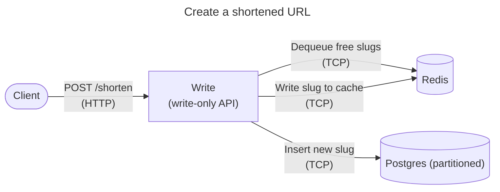
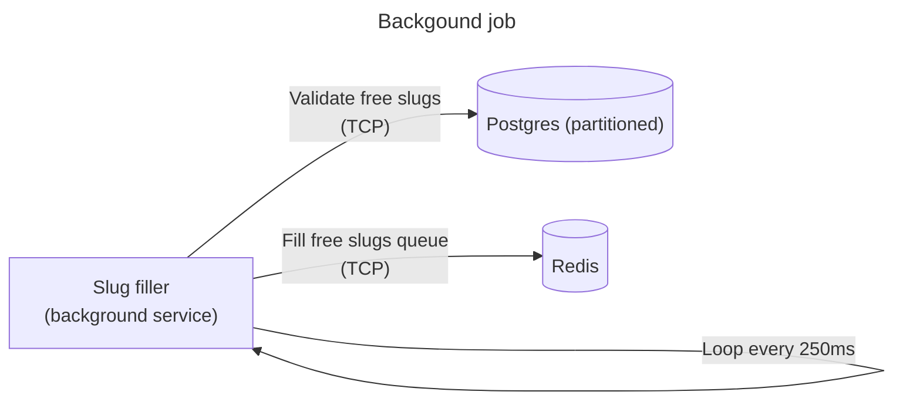

# min-url-rs

> **A fast, horizontally-scalable URL shortener in Rust.**
>
> * **redirect-svc** – 100k rps on commodity hardware, plus QR code generation.
> * **slug-filler** – Keeps slugs ready.
> * **write-svc** – Reserves aliases.

## 1. Quick start

```bash
# 1 - Clone
$ git clone https://github.com/clemlesne/min-url-rs && cd min-url-rs

# 2 - Run services in Docker (with auto-reload)
$ make dev

# 3 - Shorten a URL
$ curl -X POST http://localhost:8081/shorten \
       -H 'Content-Type: application/json' \
       -d '{"url":"https://google.fr"}'
# { "slug": "aP6eoE", "url": "https://google.fr" }

# 4 – Follow the link
$ curl -I http://localhost:8080/aP6eoE
# HTTP 302 -> Location: https://google.fr

# 5 - Download a QR code
$ curl http://localhost:8080/aP6eoE/qr?format=svg&size=256 -o qr256.svg
# Open it into your browser or explorer
```

## 2. Services

| Service | Path | Port | Role |
| - | - | - | - |
| redirect-svc | `redirect-svc/` | **8080** | GET /{slug} -> 302</br>GET /{slug}/qr -> QR code |
| slug-filler | `slug-filler/` | – | Keeps `slug_pool` filled in Redis |
| write-svc | `write-svc/` | **8081** | POST /shorten |

All three are pure async Tokio binaries, deployable as stateless pods.

## 3. API

### POST `/shorten` (write-svc)

```jsonc
{
  "url": "https://example.com",
  "alias": "optional-custom",
  "owner": "optional@user"
}
```

* **201 Created** – body `{ "alias": "…", "url": "…" }`
* **409 Conflict** – alias already exists (custom only)
* **503 Service Unavailable** – slug\_pool empty or backing store down

### GET `/{slug}` (redirect-svc)

* **302 Found** -> Location original URL
* **404 Not Found** – unknown slug

## 4. Architecture

### Design considerations

* Easy scaling: Read and write paths are separated and stateless.
* Read path: < 1 ms p99 on local network.
* Schema: 62 partitions (0-9 · A-Z · a-z) to avoid global index hot-spot.
* Slug space: Base-62⁶, 56 G possibilities.

### Architecture diagram






## 5. Local dev & tests

```bash
# Run services in Docker (with auto-reload)
$ make dev

# Benchmark a path
$ wrk -t8 -c1024 -d30s http://localhost:8080/aP6eoE
```

## 6. Ops notes

* Alert when `slug_pool` < 10k or `write_retry_total` > 1%.
* Push telemetry to an OTEL collector (e.g. Prometheus, Azure App Insights, Datadog).
* Put a CDN (Cloudflare, Fastly) in front to edge-cache 302s.
* Switch Redis to Cluster/Valkey if high QPS > 50k.
* Use `pg_partman` to manage Postgres partitions.
