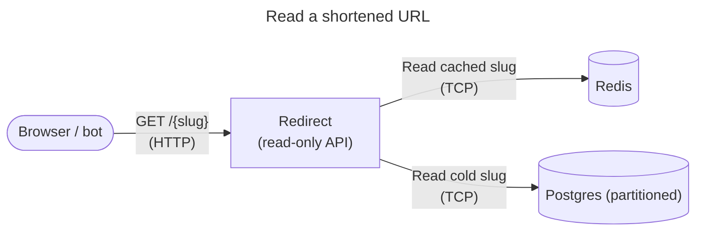
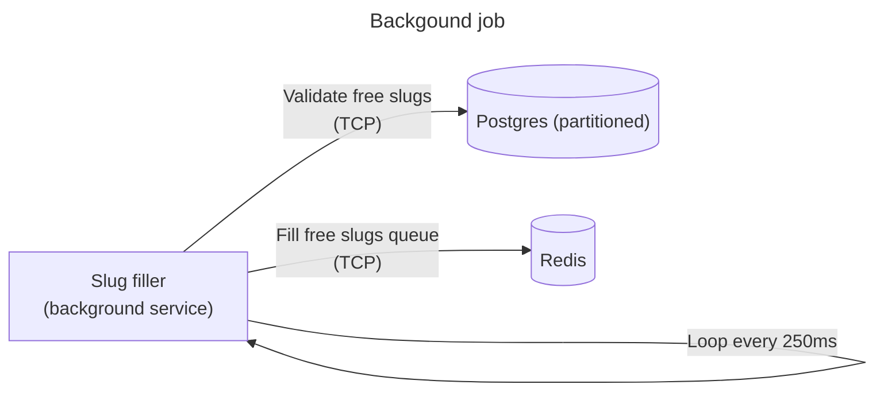

# min-url-rs

> **A fast, horizontally‑scalable URL shortener in Rust.**
>
> * **redirect‑svc** – 100 k rps GET /{slug} → 302 via LRU → Redis → Postgres.
> * **write‑svc** – POST /shorten, reserves alias, persists, back‑fills Redis.
> * **slug‑filler** – keeps ≥ 50 k random slugs ready in Redis.

## 1. Quick Start

```bash
# 1 – clone & build
$ git clone https://github.com/clemlesne/min-url-rs
$ cd min-url-rs

# 2 – launch full stack (Postgres, Redis, 3 services)
$ docker compose up --build

# 3 – shorten a URL
$ curl -X POST http://localhost:8081/shorten \
       -H 'Content-Type: application/json' \
       -d '{"url":"https://yahoo.fr"}'
# ← { "alias": "aP6eoE", "url": "https://yahoo.fr" }

# 4 – follow the link
$ curl -I http://localhost:8080/aP6eoE
# ← HTTP/1.1 302 → Location: https://yahoo.fr
```

## 2. Services

| Service      | Path            | Port     | Role                               |
| ------------ | --------------- | -------- | ---------------------------------- |
| redirect‑svc | `redirect-svc/` | **8080** | GET /{slug} → 302 (read‑only path) |
| write‑svc    | `write-svc/`    | **8081** | POST /shorten (create path)        |
| slug‑filler  | `slug-filler/`  | –        | Keeps `slug_pool` filled in Redis  |

All three are pure async Tokio binaries, deployable as stateless pods.

## 3. API

### POST `/shorten`  (write‑svc)

```jsonc
{
  "url": "https://example.com",
  "alias": "optional-custom",
  "owner": "optional@user"
}
```

* **201 Created** – body `{ "alias": "…", "url": "…" }`
* **409 Conflict** – alias already exists (custom only)
* **503 Service Unavailable** – slug\_pool empty or backing store down

### GET `/{slug}`  (redirect‑svc)

* **302 Found** → Location original URL
* **404 Not Found** – unknown slug

## 4. Architecture

### Design considerations

* Easy scaling: Read and write paths are separated and stateless.
* Read path: < 1 ms p99 on local network.
* Schema: 62 partitions (0‑9 · A‑Z · a‑z) to avoid global index hot‑spot.
* Slug space: Base‑62⁶, 56 G possibilities.

### Architecture diagram






## 5. Local Dev & Tests

```bash
# hot‑reload redirect‑svc only
$ cargo watch -w redirect-svc -x 'run -p redirect-svc'

# benchmark read path
$ wrk -t8 -c1024 -d30s http://localhost:8080/aP6eoE
```

## 6. Ops Notes

* Put a CDN (Cloudflare, Fastly) in front to edge‑cache 302s.
* Switch Redis to Cluster/Valkey when QPS > 500 k.
* Alert when `slug_pool` < 10 k or `write_retry_total` > 1 %.
